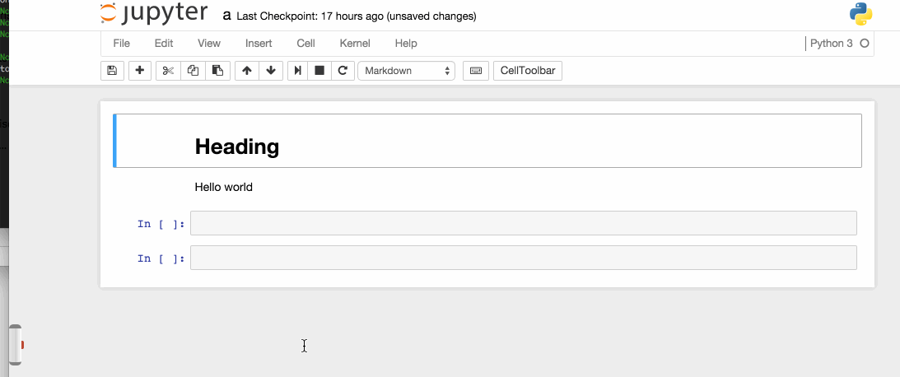

# jupyter-lightsaber
An extension that adds a light saber to your notebook



This is meant to be installed using Brian's new extension system.  However, you
can install it in the mean time by running:

```
pip install jupyter-lightsaber
ln -s $(python -c "import os; print(os.path.join(os.path.dirname(__import__('jupyter-lightsaber').__file__), 'amd'))") $(ipython locate)/jupyter-lightsaber
```

Then in your custom.js, add:
```
Jupyter.utils.load_extensions(['jupyter-lightsaber/index']);
```
(you can also, alternatively, run this using %%javascript inside your notebook)

CSS/Saber design by Nicholas Cerminara, here: http://codepen.io/ncerminara/pen/KzurJ
